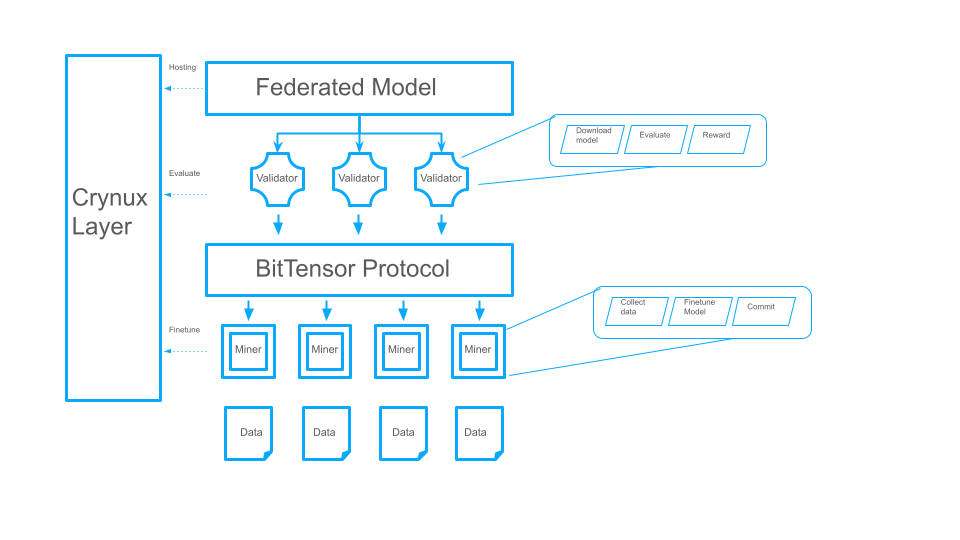

<div align="center">

# **Genki-Dama (元気玉)**
## Federated Learning subnet on BitTensor, powered by Crynux  <!-- omit in toc -->


[]([https://discord.gg/bittensor](https://discord.gg/vJZnq4ujvK))
[](https://opensource.org/licenses/MIT) 


</div>

---
- [Introduction](#introduction)
- [Federated Learning](#federated-learning)
- [Miner](#miner)
- [Validator](#validator)
- [Roadmap](#roadmap)
- [License](#license)

---

## Introduction

Genki-Dama, inspired by the iconic Dragon Ball technique, is the first open-source machine learning framework that utilizes decentralized data and harnesses decentralized computing resources. Built upon the incentive mechanism of BitTensor, and the computing network of Crynux, Genki-Dama empowers federated learning[1] in a decentralized manner, shattering the limitation of centralized approaches.

The subnet aims to incentivize miners to contribute high quality data and train creative generative models with federated learning.

It includes two parts:
* Genki: federated learning SDK to utilize BitTensor incentive mechanism and Crynux decentralized computing resources
* Dama: open-sourced model checkpoints trained by Genki, we will focus on creative generative models

Ruby is the first Dama that's for music generation. We will train a series of Ruby models for different style of music with community's effort to contribute their data and computing power.

## Federated Learning

[Federated learning](https://en.wikipedia.org/wiki/Federated_learning) is a machine learning approach designed to harness decentralized data and computing while safeguarding privacy. Its workflow can be summarized as follows:

1. Miners locally prepare data, train models, and upload weights to a central server.
2. The server aggregates gradients from miners and initiates a new round as needed.


Federated learning has been widely used in [Gboard](https://research.google/blog/federated-learning-collaborative-machine-learning-without-centralized-training-data/), [speech models](https://support.google.com/assistant/answer/11140942) without using centralized training data.

Presently, Large Language Models (LLMs) alignment demands significant [human effort](https://openai.com/index/instruction-following/) to ensure data quality. BitTensor offers a superior incentive mechanism for this process. By employing federated learning on the BitTensor subnet, miners are incentivized to contribute high-quality instruction datasets, which are invaluable assets for both OpenAI and Google, neither of whom has disclosed these datasets to date.

Furthermore, as LLM pretraining exhausts public accessible data reservoirs, federated learning emerges as a viable solution to tap into additional high-quality data for both pretraining and fine-tuning purposes.




## Miner

Utilizing Crynux decentralized computing layer, miners engage with validators by finetuning on a base model with a customized datasets. The process involves the following steps:

1. Data collect: provide a high-quality dataset for a particular finetune task.
2. Finetune: train the model with customized datasets.
3. Commit: public the model to huggingface

Miners can choose whether to share their data:
* If they share data, data will be available on marketplace to trade.
* If they keep data private, only gradients will be communicated over network.

## Validator

Validators are responsible for evaluating the performance from each miners, and set weights to each miner.

Although it is difficult to evaluate data quality directly, validators can evaluate the performance of finetuned model, and set weights considering these factors:
* Model quality: model will be evaluated by cross-validation with other datasets.
* Data similarity: validators set higher weights to data with less similarity to encourage miners provide diversified data.
* Shapley value: each data will be calculated to its shapley value as the contribution of data.

Validators order miners by their commit timestamp, and weight them with the score: (0.95 - data_similarity) * ∆loss * shapley 


## Roadmap

### Proof of Concept

We start with a music model finetuning task for proof-of-concept:

1. Miners provide high-quality datasets to fine-tune a music generation model, Ruby, that produces Chiptune style musics for games.
2. Validators evaluate the quality of the Ruby models according to the metrics defined above, and give higher weights to miners who produced the model with higher scores.

### Federated Finetune

1. The validators will produce an aggregated Dama model based on the high-score models submitted by miners.
2. Shapley value will be calculated for each miner to evaluate its contribution to the aggregated model. Miners with larger contribution will get more weights.

### Multi-modality Models

Expand the landscape to other modality models: text generation, image generation, etc.

### Data Markeplace

Miners optionally choose whether to share their data. Data quality is measured by the model trained from these data.

Clients can buy data from the marketplace.

Genki-Dama earns fees from these transactions.

### Model for Applications

Genki-Dama will be used to train models in real-world applications.

Validators evaluate the model quality via real traffic of applications. 

Genki-Dama earns license fee from these models.

## References

[1] Konečný, Jakub. "Federated Learning: Strategies for Improving Communication Efficiency." arXiv preprint arXiv:1610.05492 (2016).

[2] Zhang, Jianyi, et al. "Towards building the federatedGPT: Federated instruction tuning." ICASSP 2024-2024 IEEE International Conference on Acoustics, Speech and Signal Processing (ICASSP). IEEE, 2024.

[3] Agostinelli, Andrea, et al. "Musiclm: Generating music from text." arXiv preprint arXiv:2301.11325 (2023).

[4] Copet, Jade, et al. "Simple and controllable music generation." Advances in Neural Information Processing Systems 36 (2024).

[5] Kilgour, Kevin, et al. "Fr\'echet audio distance: A metric for evaluating music enhancement algorithms." arXiv preprint arXiv:1812.08466 (2018).

[6] Wang, Tianhao, et al. "A principled approach to data valuation for federated learning." Federated Learning: Privacy and Incentive (2020): 153-167.


## License
This repository is licensed under the MIT License.
```text
# The MIT License (MIT)
# Copyright © 2023 Yuma Rao

# Permission is hereby granted, free of charge, to any person obtaining a copy of this software and associated
# documentation files (the “Software”), to deal in the Software without restriction, including without limitation
# the rights to use, copy, modify, merge, publish, distribute, sublicense, and/or sell copies of the Software,
# and to permit persons to whom the Software is furnished to do so, subject to the following conditions:

# The above copyright notice and this permission notice shall be included in all copies or substantial portions of
# the Software.

# THE SOFTWARE IS PROVIDED “AS IS”, WITHOUT WARRANTY OF ANY KIND, EXPRESS OR IMPLIED, INCLUDING BUT NOT LIMITED TO
# THE WARRANTIES OF MERCHANTABILITY, FITNESS FOR A PARTICULAR PURPOSE AND NONINFRINGEMENT. IN NO EVENT SHALL
# THE AUTHORS OR COPYRIGHT HOLDERS BE LIABLE FOR ANY CLAIM, DAMAGES OR OTHER LIABILITY, WHETHER IN AN ACTION
# OF CONTRACT, TORT OR OTHERWISE, ARISING FROM, OUT OF OR IN CONNECTION WITH THE SOFTWARE OR THE USE OR OTHER
# DEALINGS IN THE SOFTWARE.
```
